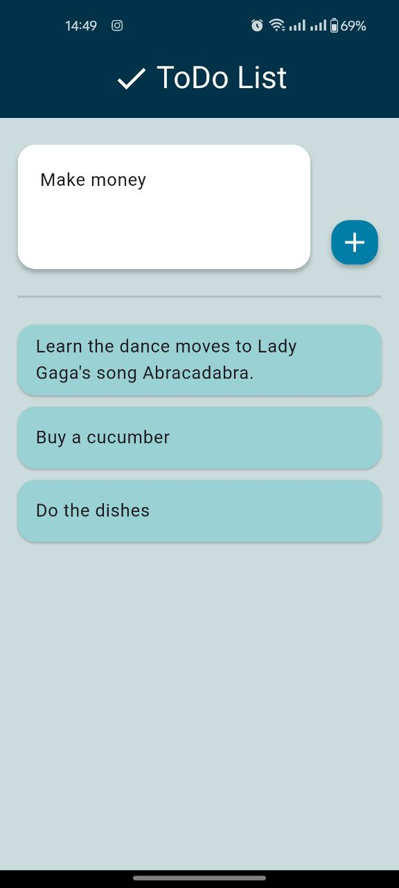
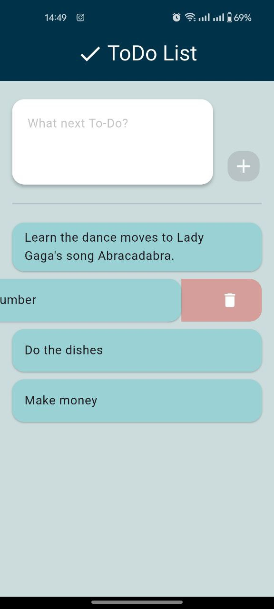

# todo_list

## Description

This is an application for creating and managing a To-Do List. Users can add and delete tasks.

## Functionality

- **Add Tasks**: Users can add new tasks to the list.
- **Deleting Tasks**: Easily delete tasks (swipe left).

## Screenshots

## Download APK

You can download the APK file for installation [here](https://github.com/VitalijMelet/todo_app/blob/main/app-release.apk)

## Development

Vitalii Mieliet
e-mail: vitalij.melet@gmail.com
Time spent: 28 hours

...
